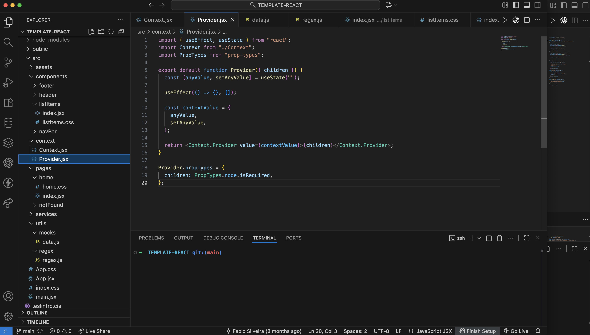

# TEMPLATE-REACT

A ready-to-use **React project template** with everything installed, configured, and organized — perfect to start new projects quickly.

## 🚀 Features
- React (Vite or CRA compatible)
- Organized folder structure with clear sections (components, pages, context, hooks)
- Global state management using **React Context**
- ESLint + Prettier setup for clean, consistent code
- Axios setup ready for API integration
- Environment variables support (`.env`)
- Easy theming and styling with your preferred CSS framework

## Screenshot




## 🛠️ Getting Started
```bash
git clone https://github.com/fabioesilveira/TEMPLATE-REACT my-app
cd my-app
npm install
npm run dev


